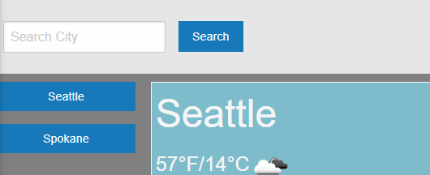
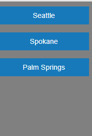
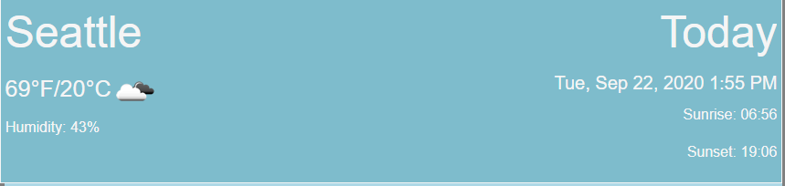
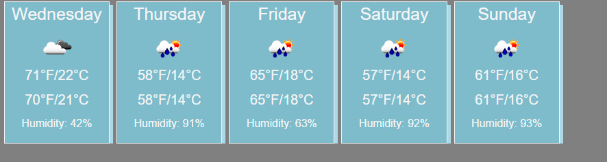

# Weather-App-Five-Day-Forecast

Here you can use this app to check your local weather forecast!
<a href="https://jjainga.github.io/Weather-App-Five-Day-Forecast/">Weather Forecast App</a>

At the top there is a search input to look for your city of interest

All the citys you search will be svaed on the left of the page, so you can easily check up on them in the future!

The main tile will show the current day's weather including the Temp/humidity/time/sunrise and sunset

Below the main tile there is a five day forecast to see how the weather is going to be shapping up in the coming days so you can plan ahead!

